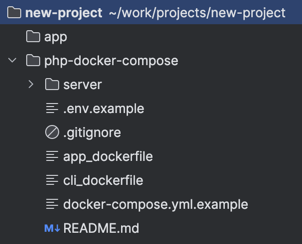

## Как использовать
- создайте папку для проекта (например new-project), если уже создана, пропустите этот пункт
- скопируйте этот пакет в папку через `git clone`
- создайте папку app для кода, если код уже есть перенесите его в эту папку (в дальнейшем путь к проекту можно изменить, как это сделать написано в следующем разделе)
- итоговый вариант должен выглядеть так

## Настройка докера
- запустите start.sh, введите имя проекта и выберите версию PHP
- скрипт сам переименуют нужные файлы и пропишет в них имя проекта и версию php
- папка проекта по умолчанию называется app, если хотите поменять, смотрите следующий пункт
- для изменения папки проекта измените значение `APP_CODE_PATH_HOST`
- остальные значения меняйте на свой страх и риск
- по умолчанию включена установка следующих пакетов: composer, xdebug, pcntl, opcache

## Настройка nginx
- после запуска start.sh, в папке nginx/conf.d появится app.conf
- обновите значение `server_name` на то которое хотите использовать

## Настройка php.ini
- после запуска start.sh, появятся соответствующие ini файлы, например php-8.4-local.ini

## FAQ
- если хотите добавить новых сервисов: добавьте какие хотите, главное не в docker-compose.yml.example, а свой
- если у вас уже есть образ: используйте второй пример app, а первый закомментируйте
